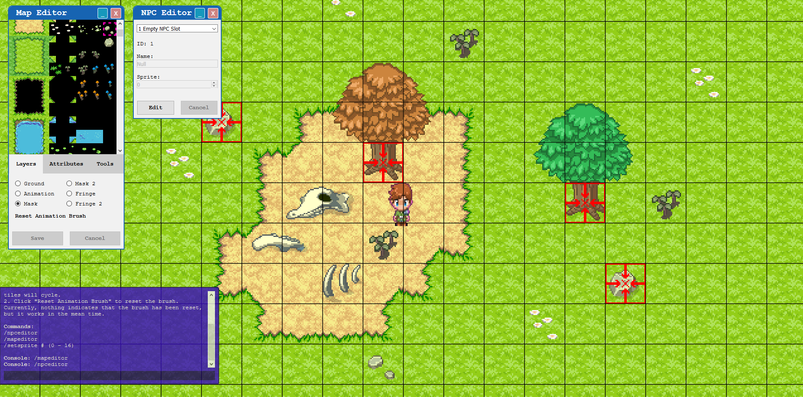

# Mirage Web Engine (Single-Player)

This project initially began as an excuse for me to brush up on HTML5 canvas drawing and got a little out of hand. I have no intention of making this multiplayer in it's current state, nor in the future. However I am considering a future separate project "Mirage Web Engine (Multi-Player) which will likely recycle and refine logic from this project.

### Project Goal:

A browser-based single player 2D top-down RPG Engine. The main goal of Mirage Web Engine SP is to provide a toolset with which to create browser based 2D RPGs for creative people looking to tell a story.

### General Specifications:

* Language: JavaScript, HTML
* Dependencies: jQuery, jQueryUI
* Version: ac-0.1.6

### Mostly Complete Features:

* Map Editor Layers
* Map Editor Collisions
* Map Editor General UI
* Dynamic Sprites (dynamic!)
* Engine Console UI (hit enter to open/close)
* Scrolling Maps! Currently 250x250 tiles! Goes up to 1Kx1K but loads slowly. Browser crashes at 2Kx2K!

### Known Bugs / Incomplete Features:

* NPC editor is pretty new and can be opened but not closed. NPCs cannot be placed into the world yet. Currently when you save an NPC it saves to every NPC slot (looking into it).
* Engine console can be opened and closed by pressing "Enter", but is unpolished. Currently you can only close the console when the console input box has focus. So if you're having trouble closing the console, just click the input box. Needs better user experience.
* Animation tiles work properly, however the way the editor handles animations is not very visually intuitive. See console notes in game for further explanation.
* THERE'S NO DATABASE/OFFLINE STORAGE! Currently nothing saves permanently. Please don't spend hours creating a neat map! It's gone the moment you close the web page.

### Upcoming Features (todo):

* NPC Editor (in progress)
* NPC Dialogue Editor
* Item Editor
* Shop Editor
* Spell Editor
* Loot Table Editor
* Quest Editor
* And several others to be added once I chop this list down a bit

### What's new in version ac-0.1.1

* Sprites are now loaded and measured dynamically. They aren't completely drawn correctly to match the way collision works. Collision is working as intended, drawing the sprites just needs minor adjustments in the future.
* Added NPCs array and began introducing more elements to the NPC editor (NPC editor is broken in it's current state, see above).

### What's new in version ac-0.1.2

* Lots of improvements to code structure and file locations. General code refactoring to accomodate.
* Massively reduced amount of world sprites and tiles to include into github.

### What's new in version ac-0.1.3

* More restructuring of major core components, code nesting, comments and code documentation.
* Fixed issue regarding the way the Npc editor pushed changes to the Npcs array.

### What's new in version ac-0.1.4

* Var Map has been replaced with worldMaps (array). Introduced new variables: maxMaps (25 by default), and activeMap (set by function setActiveMap) used for interacting with only the map the player is currently on.
* /warptomap # (0-25) command has been introduced. This is used for convenience of switching maps on the fly, and in general to demonstrate that more then one map can exist at a time.

### What's new in version ac-0.1.5

* Introduced basic NPC AI. Npcs will now wander around the map without restriction (They can wander off the map in any direction, and have no collision logic).

### What's new in version ac-0.1.6

* Npc Editor can now be closed and minimized.
* Added additional 'Attack on Sight' AI type.
* Added AI Selector to Npc Editor (Wander / Attack on Sight).
* Players now collide against Npcs.
* Npcs now collide against players.

### Authors

* **Rian Ruggles** - *Initial work* - [Frank Poth](https://www.youtube.com/watch?v=jabYMh9sI8Q)

See also the list of [contributors](https://github.com/rsruggles/MirageWebEngineSP/contributors) who participated in this project.

### License

This project is licensed under the MIT License - see the [LICENSE.md](LICENSE.md) file for details

### Acknowledgments

* [Frank Poth](https://www.youtube.com/channel/UCdS3ojA8RL8t1r18Gj1cl6w) For all the inspiration

### Important!
Please note jQuery and jQueryUI have their own separate licensing and are included for convenience. Likewise, the graphical contents of img/sprites and img/tilesets belong to KADOKAWA CORPORATION and are included for convenience, hopefully considered fair use for educational purposes. It would be unwise to distribute these assets for commercial purposes.